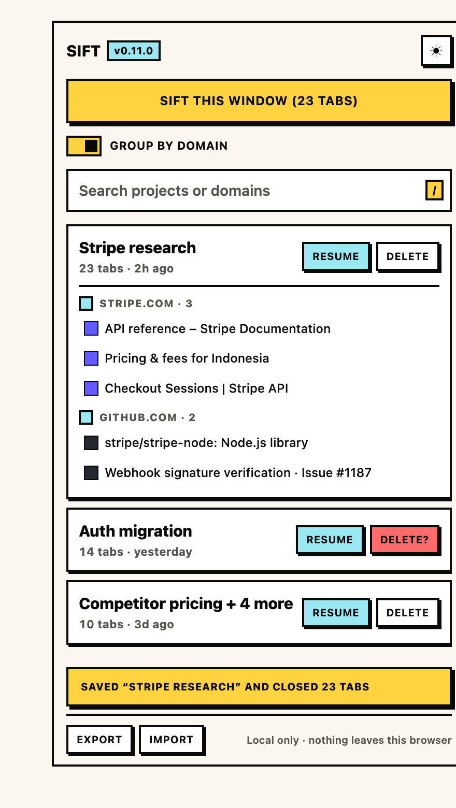
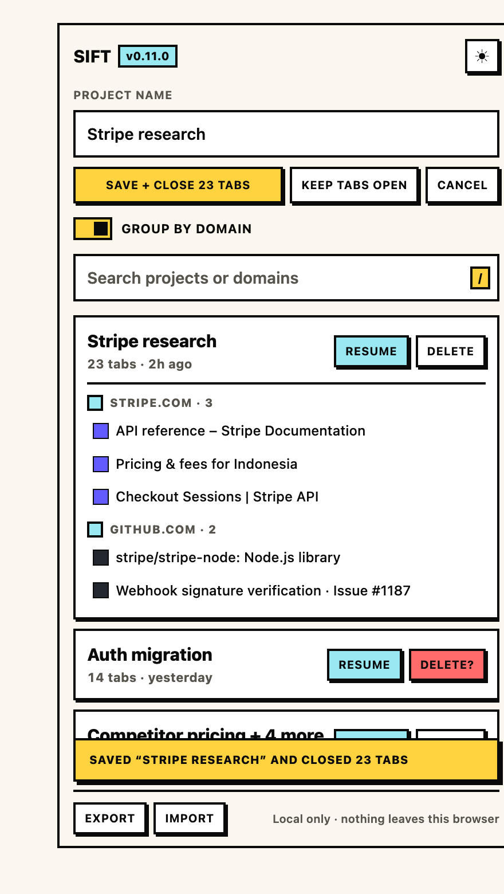
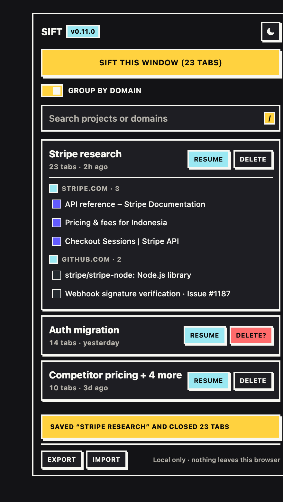

# Sift

**Close your tabs. Keep your research.**

A Chrome extension that turns a window full of tabs into a resumable research project.
Not a tab manager — a memory layer. Save the window, close the tabs without anxiety,
come back in one click.

```
Research → Save as Project → Close tabs → Resume in 1 click
```

Local-first: no backend, no account, no AI, no network calls. The whole thing is
~600 lines of plain JavaScript, loads unpacked with zero build step.

| Save a window | Resume it | Dark mode |
|---|---|---|
|  |  |  |

## Status

`v0.9.0` — local MVP, pre-store. Three features only:

| Feature | Notes |
|---|---|
| Save window as project | rule-based name suggestion (`Stripe research`), editable |
| Save + close tabs | closes only the tabs that were saved and are still open |
| List / search / resume / delete | `Resume` opens the project in a new window, in saved order |
| Group by domain | one switch: groups the current window now, and every resume after |
| Groups survive a save | resume rebuilds the groups the project was *saved* with (title + colour), even groups that mix domains; tabs with no group fall back to their domain |
| Pinned tabs are left alone | Chrome refuses to mix pinned and unpinned tabs in one group, so Sift never touches them |
| Export / import JSON | free on purpose — backup is trust, not an upsell |
| Theme toggle | header button, light by default, saved locally |

Explicitly **not** built: backend, sync, AI, dashboard, team sharing, Firefox/Safari.
The MVP is deliberately three features so the core loop can be validated before
anything with a server bill gets written.

## Layout

```
extension/          the unpacked Chrome extension (MV3, no build step)
  manifest.json       permissions: tabs, storage, sidePanel, tabGroups
  sidepanel.html/.js/.css   the whole UI + logic
  lib/store.js        storage + pure rule logic (naming, grouping, stats)
  test/store.test.mjs
docs/               screenshots used by this README (regenerate with tools/shot.sh)
tools/
  make-icons.py       generates the toolbar icons (stdlib only, no Pillow)
  contrast.py         design checks: WCAG AA, theme completeness, DOM/CSS drift
  shot.sh             headless screenshots of the UI
  preview.html        design harness — real CSS, mock content
  pack.sh             builds dist/sift-extension-v<version>.zip
```

Product strategy notes (spec, ICP, pricing, roadmap) are kept locally in `notes/`,
which is git-ignored — this repo is the code.

## Run it

1. `chrome://extensions` → enable **Developer mode**
2. **Load unpacked** → select the `extension/` folder
3. Click the Sift icon → the side panel opens

After editing code: click **⟳** on the extension card, then **close and reopen the
side panel** — reloading the extension does not re-render an open panel.
The panel header stamps the running version (`SIFT v0.9.0`), so you can always tell
which build is live.

## Develop

```bash
cd extension
node test/store.test.mjs        # rule logic: naming, grouping, stats
python3 ../tools/contrast.py    # WCAG AA, dark-theme completeness, class + listener coverage
python3 ../tools/make-icons.py  # regenerate icons
bash ../tools/shot.sh light     # → docs/preview-light.png (README screenshots)
bash ../tools/shot.sh dark save # → docs/preview-dark-save.png (save-form state)
bash ../tools/pack.sh           # → dist/sift-extension-v0.9.0.zip
```

`tools/preview.html` renders the real `sidepanel.css` with mock projects, so UI changes
can be reviewed in a normal tab instead of reloading the extension. `tools/contrast.py`
fails the build if a text pair drops below 4.5:1, if the dark theme forgets to override
a token, if a class has no CSS rule, if the preview invents UI the panel can't render,
if a button has no click listener, or if a font size or gap is written as a raw pixel
value instead of coming from the scale in `:root`.

## Design

Neobrutalist: 2px borders, hard offset shadows, flat colour blocks, zero radius,
uppercase micro-labels. Light is the default theme; dark inverts the outline
(`--ink` goes light) so the same hard-shadow language works on a dark surface.

Two enforced scales keep it from drifting: font sizes `10 / 11 / 12 / 13 / 14 / 15px`
and gaps `2 / 6 / 8 / 12px`, both declared once in `:root`.

## Privacy

Permissions are `tabs`, `storage`, `sidePanel`, `tabGroups`, `favicon` — no host
permissions. Nothing is sent anywhere: projects live in `chrome.storage.local`, and
tab icons are read from Chrome's local favicon cache (`/_favicon/`), so expanding a
project makes zero network requests.

## License

MIT — see [LICENSE](LICENSE).
